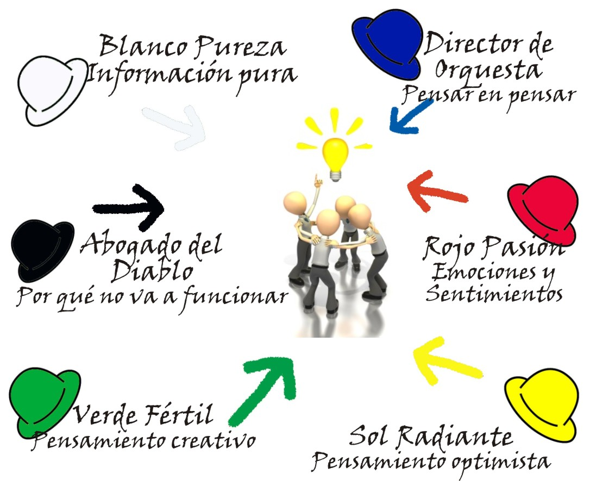

--- .segue .dark

## Índice

---

## Contenidos

### Identificación de oportunidades e ideas de negocio. 

- Necesidades y tendencias.
- Fuentes de búsqueda.
- La curiosidad como fuente de valor y búsqueda de oportunidades.
- Técnicas de creatividad en la generación de ideas.
- Los mapas mentales.
- Técnica de Edward de Bono (Seis sombreros).
- El pensamiento irradiante.

---

## Contenidos

### Análisis DAFO de la oportunidad e idea negocio.

- Utilidad y limitaciones.
- Estructura: Debilidades, Amenazas, Fortalezas, Oportunidades.
- Elaboración del DAFO.
- Interpretación del DAFO.

---

## Contenidos

### Análisis del entorno del pequeño negocio o microempresa.

- Elección de las fuentes de información.
- La segmentación del mercado.
- La descentralización productiva como estrategia de racionalización.
- La externalización de servicios: «Outsourcing».
- Clientes potenciales.
- Canales de distribución.
- Proveedores.
- Competencia.
- Barreras de entrada.

---

## Contenidos

### Análisis de decisiones previas.

- Objetivos y metas.
- Misión del negocio.
- Los trámites administrativos: licencias, permisos, reglamentación y otros.
- Visión del negocio.

---

## Contenidos

### Plan de acción.

- Previsión de necesidades de inversión.
- La diferenciación el producto.
- Dificultad de acceso a canales de distribución: barreras invisibles.
- Tipos de estructuras productivas: instalaciones y recursos materiale

--- .segue .dark

## Identificación de oportunidades e ideas de negocio

---

## Necesidades y tendencias.

### Atributos de una oportunidad de negocio

- Debe ser la respuesta a una necesidad
- Debe reflejar las características del producto requerido (bien o servicio)
- Debe sugerir el perfil de los clientes potenciales
- Debe permitir poner en práctica las capacidades, conocimientos e intereses de sus promotores.

---

## Necesidades y tendencias.

### Las tendencias

- Analizar con detenimiento las características de los cambios que ocurren en nuestra sociedad y que pueden describir en cierta forma algunas tendencias, permiten identificar áreas en las cuáles descifrar oportunidades de negocio.

---

## Necesidades y tendencias.

### Las tendencias

En la actualidad, anticiparse a los demás competidores y prever los hábitos de compra de los consumidores es esencial para diseñar estrategias comerciales, por eso, es importante extraer información de las tendencias de los sujetos involucrados en los intercambios.

---

## Necesidades y tendencias.

### Las tendencias

- **Tendencia del consumidor:** Se refiere a las costumbres, hábitos e inclinaciones que se repiten y manifiestan en el acto de compra cuya observación permite a las empresas prever y determinar unas pautas de comportamiento uniforme.

---

## Necesidades y tendencias.

### Las tendencias

- Del entorno exterior al consumidor
  - Socioculturales
  - Económicos
  - Politicos
  - Tecnológicos
  - Demográficos
  - De marketing
- Del carácter interno
  - Personales
  - Grupos Sociales
  
---

## Necesidades y tendencias.

### Las tendencias

Relacionadas con conductas y estilos de vida | Relacionadas con la situación económica nacional e internacional
-----------|-------
**Estar en forma** artefactos, bebidas, etc.|**Caída del ingreso familiar** productos sustitutos con mejores precios
**Necesidad de información** smartphones, almacenamiento en la nube | **Interdependencia de las economías nacionales** oportunidades en torno a bienes y productos complementarios
 | **Aumento de las actividades en un sector de la economía nacional** seguimiento de las políticas gubernamentales, posibilidad de desarrollar actividades conexas.

---

## Fuentes de búsqueda.

- Observación
- Análisis del comportamiento del consumidor, estudios de mercado
- Medios de comunicación/internet/redes sociales
- Experiencias propias en otros trabajos
- Bases de datos
- Cursos, talleres, seminarios
- Contactos personales
- Tendencias
- Modas
- Exposiciones, ferias, empresas de otros países

---

## La curiosidad como fuente de valor y búsqueda de oportunidades.

Los rasgos de empresarios o emprendedores que explotan la curiosidad como fuente para generar ideas y oportunidades son:

- Personas imaginativas y creativas.
- Personas abiertas a vivir nuevas experiencias.
- Desean firmemente adquirir conocimientos.
- Tienen especial sensibilidad para captar datos.
- Para ellos los detalles son muy importantes.
- Son personas optimistas y positivas.
- Escuchan la mayor parte del tiempo, no hablan demasiado excepto para preguntar.

---

## La curiosidad como fuente de valor y búsqueda de oportunidades.

- Lo cuestionan todo de una forma crítica y provechosa.
- Poseen empatía, piensan y se ponen verdaderamente en el lugar de otros.
- Aprenden de sus errores.
- Buscan una segunda o tercera opinión.
- Perseveran, indagan, llegan al fondo de los asuntos.
- Piensan diferente, usan el pensamiento divergente.

---

## Técnicas de creatividad en la generación de ideas.

---

## Técnicas de creatividad en la generación de ideas.

### Seis sombreros

---

## Los mapas mentales

<iframe width="560" height="315" src="https://www.youtube.com/embed/_q6jzZRQF9g?list=PLFxmJ9vW7pijuvyYqlKKRb1qdMtINvCNr" frameborder="0" allowfullscreen></iframe>

---

## El pensamiento irradiante

<iframe width="560" height="315" src="//www.youtube.com/embed/q2_QbOOfVI8" frameborder="0" allowfullscreen></iframe>

--- .segue .dark

## Análisis DAFO de la oportunidad e idea negocio

--- .segue .dark

## Análisis del entorno del pequeño negocio o microempresa

---

## Elección de las fuentes de información

Actualmente, la información es el nuevo y gran factor central de la economía pues, como se ha expresado, es la materia prima que abastece a los procesos de toma de decisiones.

En cualquier disciplina, si los datos de partida son erróneos, incompletos o insuficientes pueden conducir a un fracaso prematuro, disuadir de realizar un proyecto o que se descarte una buena idea. Por lo tanto, se debe prestar atención a este proceso de obtención de información para:

- Establecer objetivos y metas.
- Obtener un recurso esencial para la toma de decisiones.
- Diseñar estrategias.

---

### Características que debe tener la información

La información debe ser recopilada, procesada, clasificada y organizada de forma interna para que su entrega a los órganos responsables de la toma de decisiones sea en las mejores condiciones posibles para trabajar en ella. A continuación, se enumeran algunas características que debería reunir la información para su máximo aprovechamiento:

Fácil de entender por aquellos que van a tomar decisiones.

Que sea significativa para evitar el exceso de información.

- Que no contenga datos erróneos.
- Que se pueda comparar con otras fuentes.
- En el momento adecuado, oportuna, sin retrasos.

---

## Elecciones de las fuentes de información

### Fuentes primarias

Son aquellas que proporcionan datos o información a partir de una investigación específica, es decir, se han diseñado exclusivamente para un objetivo predeterminado.

Características:

- Son de carácter *ad-hoc*.
- Su confección exige emplear bastante tiempo.
- Tienen un elevado coste debido a que están hechas a medida.

---

## Elecciones de las fuentes de información

### Fuentes primarias, clasificación

**Cualitativas:** son las que investigan aspectos singulares o característicos de aquello a lo que se refiere el estudio o resolución de un problema determinado. Se caracterizan por:

Se recogen de fuentes más pequeñas o creadas para la ocasión: estudios de mercado, encuestas específicas o cuestionarios.

Demandan la intervención de técnicas de distintas disciplinas, pues la naturaleza de los atributos a analizar es muy variada. Suelen ser técnicas relacionadas con la psicología o sociología.

La interpretación de los datos puede ser subjetiva. Esto es debido a que la muestra de información puede ser pequeña o poco representativa, además, los encargados de evaluar los resultados también realizarán análisis basados en métodos poco objetivos.

**Cuantitativas:** son aquellas que gestionan la información seleccionada cualitativamente, extrayendo información numérica y estadística para que sean aplicables a estudios o a proyectos determinados. Se caracterizan por:

Exigir procedimientos técnicos ágiles para analizar y clasificar de forma estadística la información.

Inspeccionar, corregir o rechazar la información para poder codificarla en la unidad muestral que se desea para que la información esté en disposición de ser utilizada.

---

## Elecciones de las fuentes de información

### Fuentes secundarias

A diferencia de las primarias, proporcionan datos o información ya existentes (procedentes de otros estudios como anuarios o informes de institutos estadísticos).

Características:

- Su coste es reducido.
- El ahorro de tiempo es considerable porque están disponibles, excepto para el proceso de determinar si esa fuente se adapta a los requerimientos que se necesitan.

Clasificación:

**Internas:** si la información procede del seno de la empresa (cuentas anuales, archivos de clientes, registros de operaciones, etc.).

**Externas:** son las que son extraídas de fuentes ajenas a los recursos de la empresa, es decir, de origen exterior y a las que se pueden acceder (Internet, Instituto Nacional de Estadística, anuarios, etc.).

--- &checkbox

¿Cuáles de las siguientes son fuentes secundarias?

1. estudios de mercado
2. entrevistas
3. _libros_
4. encuestas
5. _periódicos_
6. observación específica
7. _anuarios_

*** .hint 
Piensa en si ya estaban disponibles o si se han creado para lo que estamos estudiando

--- &checkbox

¿Cuáles de las siguientes son fuentes primarias?

1. periódicos
2. _estudios de mercado_
3. _observación específica_
4. libros
5. _encuestas_
6. anuarios
7. _entrevistas_

*** .hint 
Piensa en si ya estaban disponibles o si se han creado para lo que estamos estudiando

---

## Elecciones de las fuentes de información

### Internet como fuente de información

En la última década Internet ha evolucionado como una herramienta indispensable en todos los ámbitos y máxime en el mundo de los negocios. Sus numerosas prestaciones (rapidez de respuesta, reducido coste e infinidad de posibilidades a tiempo real) la han convertido en el recurso favorito para obtener información.

Los buscadores como Google, Bing o Yahoo ocupan la mayoría de las primeras páginas de las computadoras personales para dirigirse a las fuentes más diversas: bibliotecas, universidades o periódicos virtuales de todo el mundo. Todo ello en el lapso de apenas unos segundos y con la posibilidad de almacenar o llevar a mano una cantidad de información que antes hubiera sido impensable.

Por todo ello, actualmente, Internet es, por excelencia, la herramienta líder para recabar y suministrar información.

---

## La segmentación del mercado

---

## La segmentación del mercado

La segmentación consiste en el proceso de división del mercado en grupos más pequeños que compartan determinadas características y necesidades con el objetivo de establecer una estrategia comercial para cada uno ellos de forma individualizada. Estas divisiones, acotaciones o porciones reciben el nombre de segmentos. La empresa intentará atenderlos de forma efectiva a través de una estrategia comercial diferenciada para conseguir ventajas frente a sus competidores y alcanzar sus principales objetivos comerciales.

**Finalidades**

- Diseñar estrategias comerciales más efectivas. El mayor conocimiento del segmento y su tamaño más reducido permite identificar las necesidades más específicas de los clientes. Un ejemplo de ello puede ser a la hora de hacer publicidad, pues teniendo un objetivo concreto se pueden focalizar mejor los esfuerzos.
- Consigue que las empresas sean más eficientes en todas sus áreas. Además de la función comercial, los objetivos productivos quedan mejor delimitados, la función de distribución se reduce solo al segmento objetivo con el considerable ahorro de recursos y la toma de decisiones se simplifica enormemente.
- Permite identificar oportunidades en forma de subgrupos homogéneos que no tengan una competencia alta o inexistente.

---

## La segmentación del mercado

### Requisitos de segmentación

La elección de los parámetros dependerá en gran medida del tipo del mercado, entorno y de los propios objetivos que se persigan. En este sentido, se suelen utilizar diferentes parámetros conjuntamente para que el segmento quede lo más definido posible. Los parámetros principales a considerar son los siguientes:

- Sociodemográficos: edad, sexo, renta, localización, nivel cultural, etc.
- De comportamiento de compra: fidelidad, tendencias de compra, frecuencia de compra, preferencias, gustos, etc.
- Psicológicos: intereses, opiniones, valores, personalidad, percepción, etc.

---

## La segmentación del mercado

### Tipos de segmentación

Con frecuencia se dividen en dos vertientes principales: segmentación basada en costes y segmentación basada en la diferenciación (M. Porter 1985).

**Segmentación basada en costes**

Se trata de la ventaja competitiva de aprovechar mejor las economías de escala y las variaciones de los costes asociados especialmente a algunos segmentos.

**Segmentación basada en diferenciación**

En este caso las empresas buscan segmentos compuestos por grupos de consumidores o clientes que están interesados en productos especiales o distintos.

---

## La segmentación del mercado

###Proceso de segmentación

En los dos casos siguientes se expone el proceso habitual de identificación, acotación y determinación del segmento.

**Identificación de la posible segmentación**

En esta fase los esfuerzos se centran en la observación del mercado:

Caso 1. Existen competidores que no prestan atención a un grupo determinado de clientes en su mercado pues ya tiene otros dentro del mismo que representan una cuota mayor.

Caso 2. La atención de unos competidores a un grupo de clientes sobrepasa lo requerido para satisfacerlo e incurren en elevados costes de producción.

**Acotación del segmento**

Aquí se evalúan los recursos disponibles y objetivos establecidos a partir de la información observada:

Caso 1. El grupo de clientes desatendido es el objetivo de segmentación de las empresas que están dispuestas a atender a la medida a esa porción o ámbito de mercado.

Caso 2. En este caso, los clientes estarían dispuestos a adquirir productos de elaboración más básica para satisfacer sus necesidades. Es una buena oportunidad para otras empresas que incurran en menores costes, por lo tanto, se enfoca ese ámbito de mercado como oportunidad.

---

## La segmentación del mercado

###Determinación del tipo de segmentación

En esta fase se decide qué actuación se seguirá para dividir el mercado en segmentos:

Caso 1. Segmentación basada en la diferenciación. Atenderán a ese segmento mejorando las características de los productos y satisfaciendo mejor las necesidades de sus clientes y especializándose en ellos.

Caso 2. Segmentación basada en costes. El enfoque de las empresas se basará en obtener una ventaja competitiva en el aspecto productivo, pues los clientes verán satisfechas sus necesidades a precios más bajos, ya que ellos no están buscando un tipo de producto especial o exclusivo.

---

## La segmentación del mercado

###Estrategias de segmentación

A continuación, se exponen las principales estrategias de segmentación:

**Estrategia de Marketing Masivo:** es aquel que comercializa productos cuya producción se realiza en grandes cantidades. El producto tiene escasa diferenciación y los costes suelen ser reducidos. Su principal ventaja es que el mercado al que va dirigido es muy grande y no presentan necesidades específicas. Su mayor desventaja es que los mercados están cada vez más y más segmentados con lo que es difícil conseguir un producto que funcione bien a través del marketing masivo.

**Estrategia de concentración del mercado:** también conocida como de un solo segmento, consiste en la penetración de un determinado segmento del mercado global que se encuentra abierto con el objetivo de especializarse en él y diferenciar sus productos o servicios para atenderlo de forma efectiva y liderarlo.

**Estrategia de segmentos múltiples:** las empresas concentran sus esfuerzos en atender varios segmentos de clientes potenciales y trata de llegar a cada uno a través de diferentes versiones o líneas de un mismo producto básico. Para ello, usará distintos sistemas de distribución, publicidad y precios diferenciados entre otros recursos.

**Estrategia de nicho de mercado:** son las que usan aquellas empresas que se especializan en atender a los pequeños subgrupos homogéneos que las grandes empresas no atienden por ser poco rentables o desconocen de su existencia. Estas empresas ofrecen servicios y productos muy específicos y aunque el volumen de negocio al que optan es pequeño también suelen serlo las dimensiones de las mismas.

---
## Diferenciación (provis.)

--- .segue .dark

## Análisis de decisiones previas

--- .segue .dark

## Plan de acción

--- 

